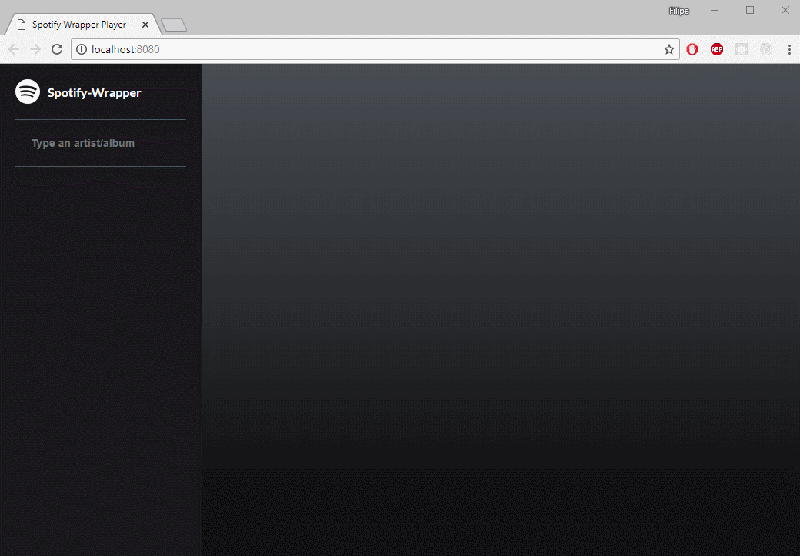
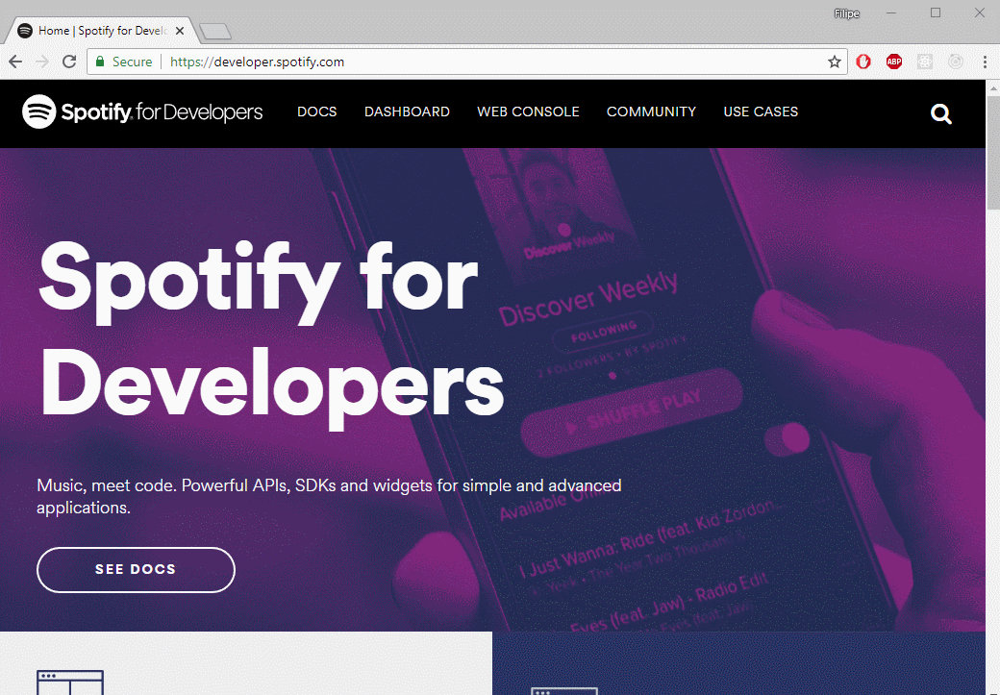
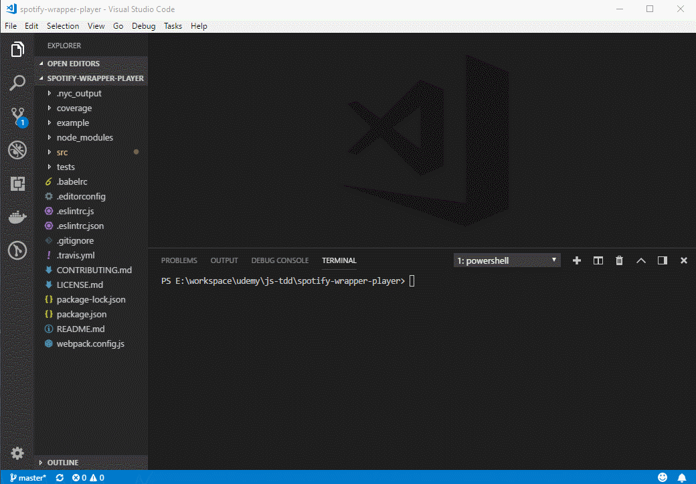

# Spotify Wrapper Player

[](https://travis-ci.org/filipegorges/spotify-wrapper-player)

[](https://coveralls.io/github/filipegorges/spotify-wrapper-player?branch=master)



Udemy course: https://www.udemy.com/js-com-tdd-na-pratica/

This player makes use of the [spotify-wrapper](https://github.com/filipegorges/spotify-wrapper) library and provides UI interactions for finding albums, discovering tracks and previewing them.

## Getting Started

Access [Spotify for Developers](https://developer.spotify.com/) and get a new token (lasts for an hour):



Download or clone the project, access it, add your token to the SpotifyWrapper and start the server:



**Note**: make sure the port ```8080``` is free before running the application.

### Prerequisites

In order to run this project locally, you'll need ```node``` and ```npm``` installed:

```
# For Debian-based distributions:
sudo apt update
sudo apt install nodejs
sudo apt install npm

# For RHEL-based distributions:
sudo dnf update
sudo dnf install nodejs
sudo dnf install npm

# For Windows/macOS:
https://nodejs.org/en/download/
```
You'll also need an account at [Spotify for Developers](https://developer.spotify.com/)

## Running the tests

To run the tests once:

```
npm run test
```

To keep running the tests, watching for file changes (TDD-style):
```
npm rum test:tdd
```

To check test coverage:
```
npm run test:coverage
```

### Coding style tests

In order to maintain the coding style ESlint is part of the project and can be activated manually by running:

```
npm run lint
```
this command will automatically be executed before pushing commits to origin, alongside the ```test:coverage``` and will lock the pushing process should the code not be valid according to the defined coding style.

## Built With

* [Babel](https://babeljs.io/) - Javascript compiler
* [NPM](https://www.npmjs.com/) - Package manager
* [Reuwsaat Spotify Wrapper](https://www.npmjs.com/package/reuwsaat-spotify-wrapper) - Spotify Wrapper lib

## Contributing

Please read [CONTRIBUTING.md](https://gist.github.com/PurpleBooth/b24679402957c63ec426) for details on our code of conduct, and the process for submitting pull requests to us.

## Versioning

We use [SemVer](http://semver.org/) for versioning. For the versions available, see the [tags on this repository](https://github.com/your/project/tags).

## Authors

* **Filipe Gorges Reuwsaat** - [GitHub](https://github.com/filipegorges)

See also the list of [contributors](https://github.com/your/project/contributors) who participated in this project.

## License

This project is licensed under the MIT License - see the [LICENSE.md](LICENSE.md) file for details